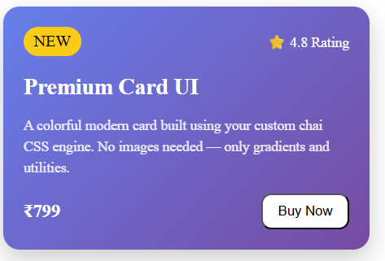

# ChaiTailwind
# ☕ Chai CSS Engine

A lightweight utility-first CSS engine built using JavaScript.  
Instead of writing traditional CSS, you can use custom `chai-*` classes that are dynamically converted into inline styles in the browser.


## 🎯 Project Overview

Chai CSS Engine is a mini frontend styling system inspired by utility-first frameworks like Tailwind CSS.

It works by scanning the DOM, detecting custom `chai-*` class names, and converting them into real CSS styles using JavaScript.

---

## ⚙️ How It Works

1. The script waits for the DOM to load
2. It scans all HTML elements
3. Finds classes starting with `chai-`
4. Parses each class into a key-value pair
5. Converts them into inline CSS styles
6. Applies styles directly to elements
7. Removes processed classes
8. Adds hover effects dynamically (if present)

---
## 📸 Screenshots




---

## 🧠 Example

### HTML Input:
```html
<div class="chai-p-20 chai-bg-blue chai-text-center chai-rounded-10">
  Hello World
</div>